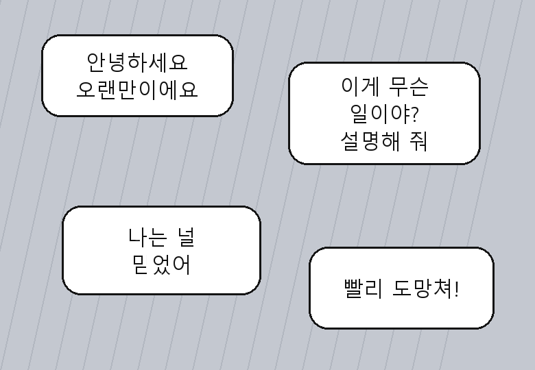
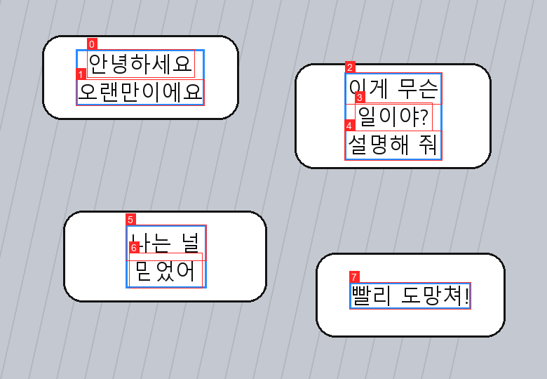
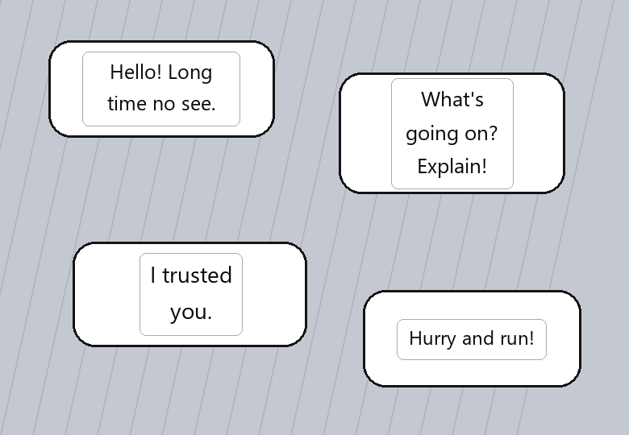

# Tradutor de webtoon coreano

Lê o coreano que está **dentro da imagem**, traduz para inglês e desenha a
tradução por cima — em qualquer janela, não só no navegador.

Aperte `Ctrl+Alt+Q`, arraste um retângulo sobre a página, e a tradução aparece
no lugar dos balões. Rolar a página faz o overlay sumir.

Roda inteiramente na sua máquina: OCR na GPU e tradução por um LLM local via
Ollama. Nenhuma imagem sai do computador e não há custo por uso.

---

## Exemplo prático

As imagens abaixo usam `samples/_synthetic.png`, uma página de teste gerada
pelo próprio projeto (`tests/make_synthetic.py`) — assim o repositório tem um
exemplo reproduzível sem redistribuir arte de terceiros. As webtoons reais que
você usa para testar ficam em `samples/` e não são versionadas; as saídas delas
aparecem em `out/` quando você roda os comandos.

### 1. Entrada

Balões com hangul dentro do desenho. Não dá para selecionar nem copiar.



### 2. Detecção e agrupamento

```powershell
uv run wt translate samples/_synthetic.png -o out/_synthetic_en.png --debug-out out/_synthetic_dbg.png
```

**Vermelho** = linha lida pelo OCR. **Azul** = balão depois do agrupamento.



Repare no balão do meio: o OCR devolveu **três** caixas vermelhas (`이게 무슨`,
`일이야?`, `설명해 줘`) e o agrupamento fundiu as três numa caixa azul só. As
quebras de linha ali são diagramação, não gramática — o tradutor precisa
receber a frase inteira ou traduz pedaço solto.

### 3. Saída

```
4 balao(oes) em 4.41s

[ 0] 안녕하세요 오랜만이에요
     -> Hello! Long time no see.
[ 1] 이게 무슨 일이야? 설명해줘
     -> What's going on? Explain!
[ 2] 나는 널 믿었어
     -> I trusted you.
[ 3] 빨리 도망쳐!
     -> Hurry and run!
```



A caixa branca cobre o original e o corpo da fonte é escolhido por busca
binária até o texto quebrado caber. **É exatamente esta imagem que o overlay
desenha na tela** — mesmo código de layout, medidor diferente.

### Nas páginas reais

Nos três prints de webtoon que estão em `samples/`, o resultado medido:

| Página | Balões | Tempo total | Saída |
|---|---|---|---|
| `001009` | 4 | 4,9 s | `out/001009_en.png` |
| `001107` | 2 | 4,1 s | `out/001107_en.png` |
| `001126` | 3 | 4,1 s | `out/001126_en.png` |

Detecção acertou todos os balões de diálogo nas três. Duas limitações reais
observadas: **efeitos sonoros desenhados à mão não são detectados**, e letra
muito estilizada produz erro de leitura ocasional — que é justamente o motivo
de `use_vision` existir (veja abaixo).

---

## Requisitos técnicos

### Hardware

| Item | Mínimo | Esta máquina |
|---|---|---|
| GPU | NVIDIA com 8 GB VRAM e CUDA | RTX 5060 Ti 16 GB (Blackwell, `sm_120`) |
| Driver | CUDA 12.9+ | 596.49 |
| RAM | 16 GB | 32 GB |
| Disco | ~15 GB | — |

A GPU precisa segurar o LLM (~8 GB) e o OCR ao mesmo tempo. **Sem GPU o
projeto roda**, com `device = "cpu"` no `config.toml`, mas o OCR passa de
0,25 s para 5 s por página e o Ollama fica lento demais para leitura contínua.

Os ~15 GB de disco são: `gemma3:12b` em q4 (8,1 GB), wheels do CUDA (~4 GB) e
os modelos do PaddleOCR (~100 MB).

### Software

| Componente | Versão testada | Papel |
|---|---|---|
| Windows | 11 | Overlay e captura usam API do Windows |
| Python | **3.12** | `<3.13` — ver "Por quê" abaixo |
| [uv](https://docs.astral.sh/uv/) | recente | Gerencia venv e o índice extra do Paddle |
| [Ollama](https://ollama.com) | recente | Serve o LLM em `127.0.0.1:11434` |
| PaddlePaddle-GPU | **3.3.1** | Inferência do OCR |
| PaddleOCR | 3.4.1 | Detecção + reconhecimento coreano |
| PySide6 (Qt) | 6.11 | Overlay e seletor |
| `gemma3:12b` | — | Tradução (multimodal) |

### Instalação

```powershell
winget install astral-sh.uv
winget install Ollama.Ollama

ollama pull gemma3:12b
uv sync                    # cria a venv 3.12 e resolve tudo, inclusive CUDA
```

Verificação:

```powershell
uv run python -c "import paddle; print(paddle.device.is_compiled_with_cuda())"   # True
uv run pytest tests/ -q                                                          # 28 passed
uv run wt translate samples/_synthetic.png -o out/teste.png                      # 4 balões
```

Na primeira execução o PaddleOCR baixa os modelos (~100 MB) e o Ollama sobe o
`gemma3:12b` na VRAM (~80 s). Depois disso os dois ficam quentes.

---

## Como usar

```powershell
uv run wt-app        # sobe na bandeja e ativa o atalho global
```

Espere o ícone da bandeja dizer **"pronto"** (~1 min na primeira vez: carrega o
OCR e sobe o modelo na VRAM). A partir daí:

| Ação | O que faz |
|---|---|
| `Ctrl+Alt+Q` | Congela a tela para você arrastar o retângulo |
| Arrastar | Seleciona a área — pode ser um balão ou a página toda |
| `Esc` | Cancela a seleção, ou limpa o overlay se já está desenhado |
| Botão direito | Cancela a seleção |
| Roda do mouse | Limpa o overlay (rolou = desalinhou) |
| Ícone na bandeja | Ligar/desligar e sair |

O overlay é **click-through**: você continua clicando, rolando e navegando
normalmente com ele na tela.

### Linha de comando

O pipeline é exercitável por partes, sem interface gráfica:

```powershell
uv run wt ocr       samples/pagina.png --debug-out out/caixas.png   # só o OCR
uv run wt translate samples/pagina.png -o out/pagina_en.png         # tudo, saída em PNG
uv run wt snip --translate                                          # recorta da tela e traduz
uv run pytest tests/ -q                                             # agrupamento e ajuste de fonte
uv run python tests/make_synthetic.py                               # regera a página de teste
```

`wt ocr` grava uma imagem com as caixas numeradas, que casam com os índices
impressos no console — é como se avalia qualidade de OCR de verdade.

---

## Como funciona

```
captura da tela  →  OCR (PaddleOCR coreano, GPU, upscale 2×)
                 →  agrupamento em balões (2 passadas)
                 →  tradução (Ollama, 1 requisição por página, com a imagem)
                 →  overlay click-through
```

| Etapa | Arquivo | Nota |
|---|---|---|
| Captura | `capture.py` | Coordenadas do desktop virtual; podem ser negativas |
| Seleção | `selector.py` | Congela a tela e deixa arrastar o retângulo |
| OCR | `ocr/paddle.py` | Upscale 2× antes de reconhecer |
| Agrupamento | `grouping.py` | Duas passadas: fragmentos → linhas → balões |
| Tradução | `translate/ollama.py` | Página inteira numa requisição, com o recorte junto |
| Cache | `translate/cache.py` | SQLite; reler um capítulo é instantâneo |
| Render PNG | `render/compose.py` | Mesmos `Block` do overlay |
| Overlay | `render/overlay.py` | Janela transparente ao mouse |
| Orquestração | `pipeline.py` | Um caminho só, usado pela CLI e pelo app |

---

## Por que cada escolha

### Por que LLM local em vez de API de tradução

Tradução de webtoon é diálogo: gíria, honorífico, quem fala com quem. Um
tradutor estatístico devolve frase correta e morta. Um LLM vendo a **página
inteira** acerta o tom e a continuidade. Local, ainda por cima, significa custo
zero por uso e nenhuma imagem saindo da máquina — e você lê capítulo inteiro,
não uma frase.

### Por que `gemma3:12b`

Três motivos, nesta ordem:

1. **Não tem "modo pensamento".** O `qwen3` gasta tokens raciocinando antes de
   responder, o que adiciona latência em cada página. Aqui a latência é o
   produto.
2. **É multimodal.** Isso desbloqueou a correção de OCR pela imagem, que virou
   o maior ganho de qualidade do projeto (veja `use_vision` abaixo).
3. Cabe folgado nos 16 GB junto com o OCR.

### Por que a página inteira numa requisição só

Balão a balão perde o contexto que faz a tradução ficar boa, e multiplica a
latência pelo número de balões. Numa requisição só, as falas vão numeradas e a
resposta é forçada a um **schema JSON** pelo próprio Ollama — não sobra texto
solto para adivinhar no parsing. O `_parse` remonta por `id`, nunca por
posição: se o modelo pular uma fala, aquele balão fica sem tradução em vez de
deslocar todos os outros.

### Por que PaddleOCR na GPU (o plano dizia CPU)

O plano original evitava a GPU supondo que Blackwell (`sm_120`) seria
problemático no Paddle. Testado, os números inverteram a decisão:

| | Detecção | Tempo/página | Linhas lidas |
|---|---|---|---|
| **GPU** | `PP-OCRv5_server_det` | **0,25 s** | 10/10 |
| CPU | `PP-OCRv5_mobile_det` | 5,0 s | 8/10 |
| CPU | `PP-OCRv5_server_det` | 23 s | 10/10 |

A GPU entregou o modelo **mais preciso** e 20× mais rápido. A CPU virou
fallback explícito, com o modelo leve — o preciso é inviável sem placa.

### Por que upscale 2× antes de reconhecer

Texto de webtoon em zoom 100% é pequeno demais para o modelo de
reconhecimento. Ampliar com LANCZOS antes de ler é **o maior ganho isolado de
acurácia do pipeline**, e custa quase nada na GPU.

### Por que o agrupamento tem duas passadas

O plano previa uma. A saída real do OCR exigiu duas, porque o espaço entre
palavras parte uma linha visual em várias caixas:

1. **Fragmentos → linhas**: funde caixas horizontalmente adjacentes na mesma
   linha visual.
2. **Linhas → balões**: funde linhas empilhadas, unindo com **espaço, não
   quebra de linha**.

Os dois passos usam union-find, porque a conectividade é transitiva: se A toca
B e B toca C, os três são o mesmo balão mesmo que A e C não se toquem.

### Por que `use_vision` vem ligado

Um erro de OCR não vira texto estranho — vira **conteúdo plausível e falso**.
Numa das páginas reais, uma sílaba lida errado fez o modelo inventar um nome
próprio que não existe na história.

A correção foi mandar o recorte **junto** do texto, com a instrução de que a
imagem é a fonte da verdade e o OCR é só uma dica. O nome inventado sumiu e
dois termos técnicos melhoraram. Custa 1 a 4 s por página. Se quiser
velocidade, `use_vision = false`.

### Por que Python 3.12 e não 3.13

O 3.13 distribuído pela Microsoft Store roda em sandbox de arquivos e faltam
wheels para parte da stack. O `uv` instala um 3.12 isolado, sem tocar no
Python do sistema.

### Por que `uv` com índice extra

As wheels `win_amd64` do `paddlepaddle-gpu` e das bibliotecas CUDA **não estão
no PyPI** — só no índice do próprio Paddle. O `pyproject.toml` declara esse
índice e roteia pacote por pacote para ele.

### Por que o `textfit` não conhece nem PIL nem Qt

Ele recebe uma função `measure` injetada. É por isso que o PNG e o overlay
desenham idêntico: mesma lógica de quebra e mesma busca binária de corpo de
fonte, só o medidor muda. E é o que permitiu validar a aparência final salvando
PNGs, meses antes de existir janela.

### Por que caixa branca e não inpainting

Caixa branca é uma linha de código e resolve 100% do problema de legibilidade.
Inpainting preserva o desenho do balão e é claramente melhor — mas é um projeto
à parte. O objetivo era ler o capítulo.

---

## Detalhes que custaram tempo

Anotados porque não são óbvios e voltariam a morder:

- **O modelo de reconhecimento precisa ser nomeado explicitamente.** Se o
  PaddleOCR deduzir a partir de `lang="korean"`, o reconhecimento devolve
  strings **vazias** na GPU — sem erro, sem aviso.
- **Não há fallback automático de GPU para CPU.** Depois de uma inicialização
  de GPU malsucedida o Paddle fica com estado global inconsistente e passa a
  devolver texto lixo com alta confiança. Falhar é melhor. Use
  `device = "cpu"` no `config.toml` conscientemente.
- **O oneDNN do PaddlePaddle 3.3 está quebrado** no executor PIR
  (`ConvertPirAttribute2RuntimeAttribute not support`), então fica desligado
  no modo CPU.
- **As wheels CUDA da NVIDIA precisam vir declaradas** no `pyproject.toml` e
  apontadas para o índice do Paddle: o `paddlepaddle-gpu` não as arrasta
  sozinho, e sem `cudnn64_9.dll` a GPU falha na primeira inferência.
- **O OCR come os espaços.** O reconhecimento devolve `자질만좋으면` em vez de
  `자질만 좋으면`. Não é um bug a corrigir — o LLM lê assim sem dificuldade, e
  o prompt avisa que isso vai acontecer.
- **Erro de OCR vira conteúdo inventado.** É o motivo de `use_vision` existir
  e vir ligado.
- **DPI awareness antes do Qt.** `winenv.setup()` roda no import do `qtutil`,
  porque o Qt lê o ambiente no *import*, não na criação do `QApplication`. Sem
  isso, com a tela em escala diferente de 100% a captura sai em pixels físicos
  e o Qt desenha em lógicos — o overlay aparece deslocado.
- **O console do Windows é cp1252 e não tem hangul.** Imprimir o texto lido
  levantava `UnicodeEncodeError` e derrubava o comando *antes* de salvar o PNG.
  A CLI força UTF-8 no stdout logo na entrada.

### Ruído inofensivo na inicialização

Estas duas linhas aparecem ao subir e **não são erro** — o Paddle procura o
`ccache`, que só serve para compilar operadores C++ customizados (nunca
compilamos nada; usamos modelos pré-construídos):

```
INFORMAÇÕES: não foi possível localizar arquivos para o(s) padrão(ões) especificado(s).
UserWarning: No ccache found. Please be aware that recompiling all source files...
```

---

## Medições nesta máquina

RTX 5060 Ti 16 GB, i5-14600KF, `gemma3:12b`:

| Etapa | Tempo |
|---|---|
| OCR, um balão | 0,04 s |
| OCR, página inteira | 0,25 s |
| OCR, página alta (800×2400) | 0,76 s |
| Tradução, 1 a 5 balões | 1,8 – 3,3 s |
| Tradução vinda do cache | instantânea |
| Subir o modelo na VRAM (uma vez) | ~80 s |
| Página real ponta a ponta, sem `use_vision` | 5,5 – 7,0 s |
| Página real ponta a ponta, com `use_vision` | 6,9 – 11,2 s |

Em CPU o mesmo OCR leva 5 s por página com o modelo leve, e 23 s com o preciso.

---

## Configuração

Tudo em `config.toml`, e todo campo é opcional — os valores lá são os mesmos
defaults do código, deixados à vista com o porquê de cada um. Os dois que você
mais pode querer mexer:

```toml
[translate]
use_vision = false      # troca qualidade por ~3 s por página

[ocr]
device = "cpu"          # se a placa der problema
```

---

## Testes

```powershell
uv run pytest tests/ -q     # 28 testes
```

Cobrem `grouping.py` e `textfit.py` — são funções puras, sem GUI e sem rede, e
concentram a lógica que quebra silenciosamente. OCR, overlay e Ollama são
validados por inspeção visual: `wt ocr --debug-out` para as caixas e
`wt translate -o` para a arte final.

---

## Próximos passos

- **Modo hover**: traduzir o balão sob o cursor sem arrastar caixa — a ideia
  original; depende de detecção contínua
- **Inpainting** no lugar da caixa branca, preservando o desenho do balão
- **Glossário de nomes próprios**, para não mudarem a cada capítulo
- **Modo tela cheia**: um atalho traduz tudo que está visível
- **Efeitos sonoros**: hoje não são detectados
